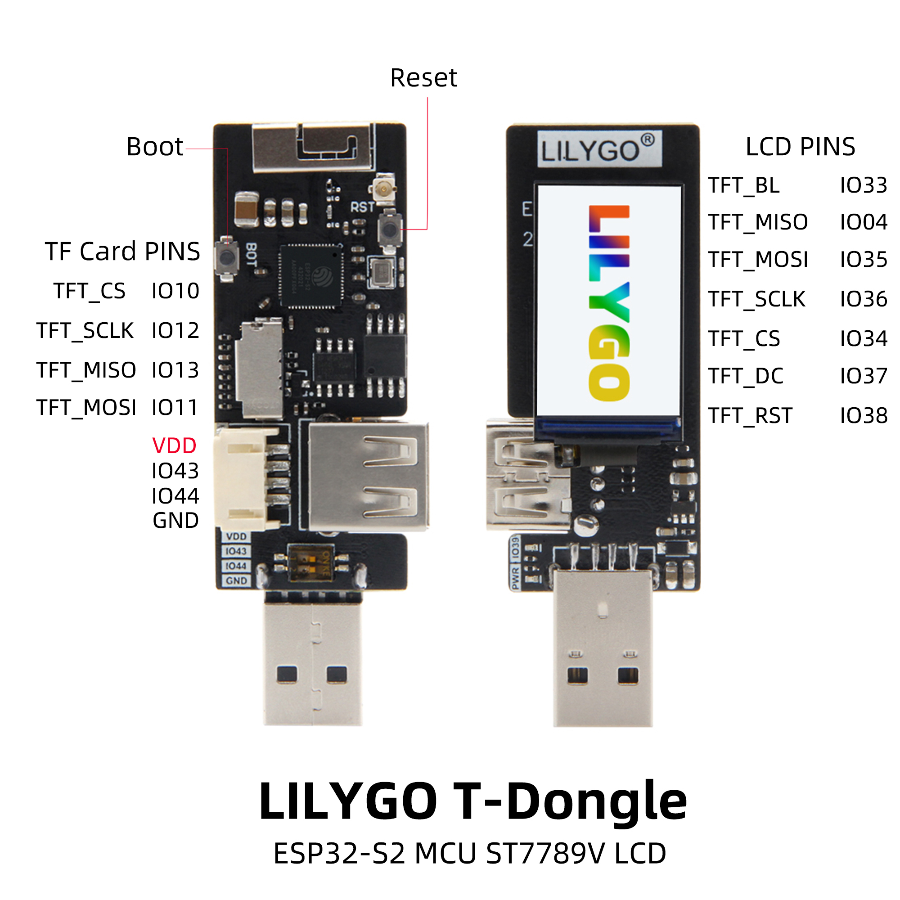
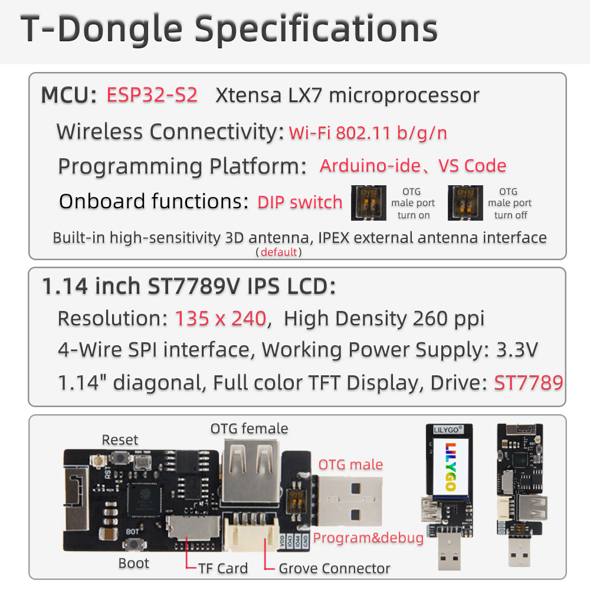
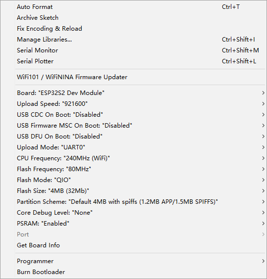
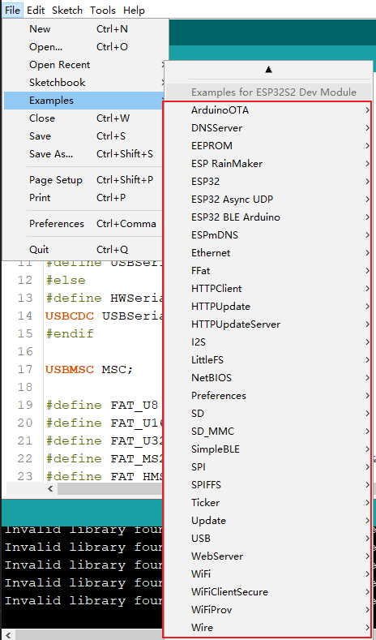

<h1 align = "center">🌟LilyGo T-Dongle🌟</h1>

# Introduce

### `The DIP switch just controls the on-off of the USB data line below`

# Quick Start
## Arduino 
1. Click "File" in the upper left corner -> Preferences -> Additional Development >Board Manager URL -> Enter the URL in the input box

> `https://raw.githubusercontent.com/espressif/arduino-esp32/gh-pages/package_esp32_index.json`

2. Click OK and the software will be installed by itself. After installation, restart the Arduino IDE software.

3. Paste everything in the lib folder into the `\Documents\Arduino\libraries `directory. The TFT driver model is ST7789. The annotated information in the file is the TFT_eSPI library pin number. No modification is required if the TFT_eSPI provided in the lib is used. Other libraries can refer to pins for configuration.

4. [Please refer to this guide for drivers](https://docs.espressif.com/projects/esp-idf/en/latest/esp32s2/api-guides/dfu.html)